<p align="center"><a href="https://www.verygoodsecurity.com/"></a></p>
<p align="center"><a href="https://www.verygoodsecurity.com/"></a></p>
<p align="center"><b>@vgs/vgs-satellite</b><br/>VGS Offline integration/debugging application.</p>
<p align="center">
<a href="https://circleci.com/gh/verygoodsecurity/vgs-satellite/tree/master"></a>
</p>


<!-- toc -->
* [Prerequisites](#prerequisites)
* [Description](#description)
* [How to start application](#how-to-start-application)
    * [Configurations](#configurations)
* [How to use](#how-to-use)
    * [How to generate route](#how-to-generate-route)
    * [How to manage routes](#how-to-manage-routes)
* [Reverse proxy mode](#reverse-proxy-mode)
* [mitmproxy](#mitmproxy)
<!-- tocstop -->

## Prerequisites

- python =>3.8.0 (python --version)
- npm =>6.14.0 (npm --version)

## Description

VGS Satellite is an application that can ease your integration with Very Good Security to achieve Zero Data security.

VGS Satellite provides:

    - Demo VGS Vault capabilities
    - Redact/reveal functinality
    - JSON payload request/response transformer
    - Route configuration generator according to specific request
    - Route configuration editor
    - Logging
    - Man-in-the-middle proxy functionality (request incertept/replay/edit/etc)
     
This  application gives you an ability to run requests with your service and transform them into suitable VGS route configuration
without any need to sign up.

_Note: VGS Satellite is in beta right now and is being run in electron development mode. Going forward VGS Satellite would be a bundled up executable._

## How to start application

1. Clone sources
    ```bash
        git clone git@github.com:verygoodsecurity/vgs-satellite.git && cd vgs-satellite
    ```
   
1. Install dependencies

   ```bash
       npm ci
   ```
   
    
1. Run application...
 
    ```bash
       npm run start:app
    ```
   
   _Note: This would run application in electron locally. If you need to run in browser use `npm start`_

## How to use 

When started VGS Satellite runs 2 proxies:
    - reverse proxy (default port: 9098)
    
    - forward proxy (default port: 9099)
    

_Note: Reverse proxy is started with dummy upstream, and can be used only when at least 1 inbound route is created_ 

### Configurations

Satellite support following parameters:

- `web_server_port` - ports that is used by backend webservice (default: 8089)
- `reverse_proxy_port` - reverse proxy port (default: 9098)
- `forward_proxy_port` - forward proxy port (default: 9099)

You can override default values using configuration file. Default location for config file is `~/.vgs-satellite/config.yml`
You can find config file example at `config.yml-example`

You can also override them using command line arguments:

- `--web-server-port` - ports that is used by backend webservice
- `--reverse-proxy-port` - reverse proxy port
- `--forward-proxy-port` - forward proxy port
- `--config-path` - path for config file. 

Overriding priority from highest priority to lowest is:

Command argument -> Configuration file -> Default value


### How to generate inbound route

Lets use inbound route for redact scenario

1. Navigate to routes page and click `Add route` -> `Inbound route`

   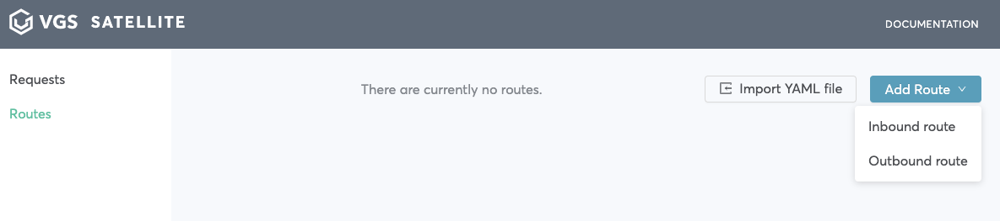
   
1. Add upstream, for example `interactive-form.herokuapp.com` and click `Save`

   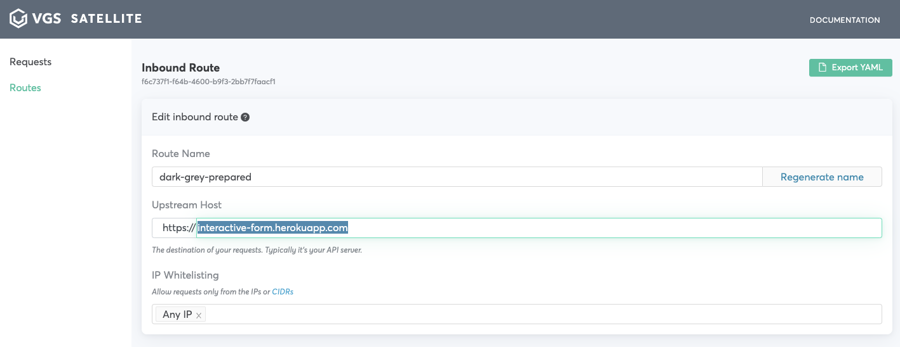
   
1. Visit `localhost:9098` and make request you want to secure or make request directly to `localhost:9098`

  _Note: If you are using `interactive-form.herokuapp.com` as an upstream, click `Fill`, then `Place Order`_ 

  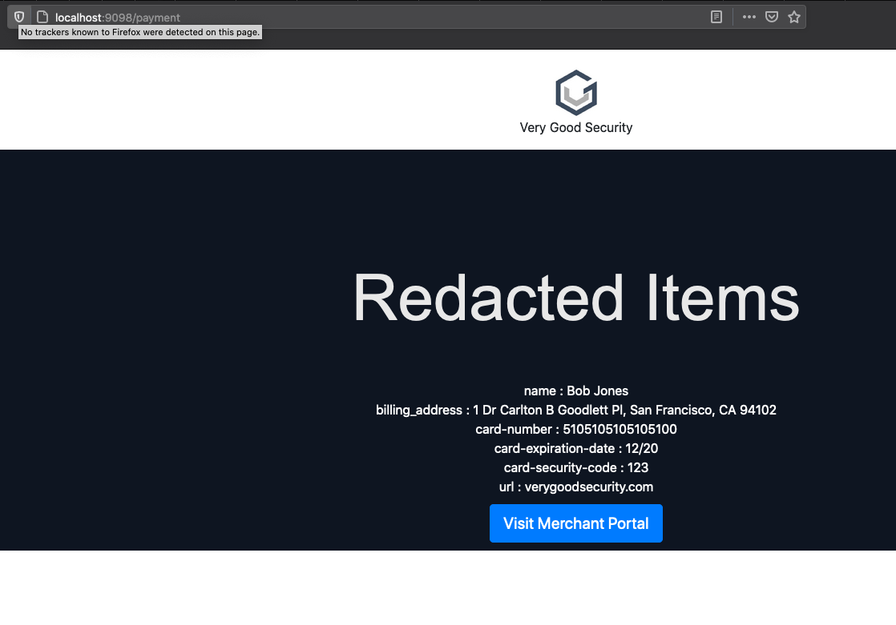
  
1. Find your request in requests list and click it

  _Note: For our example we take `/payment` request_
  
  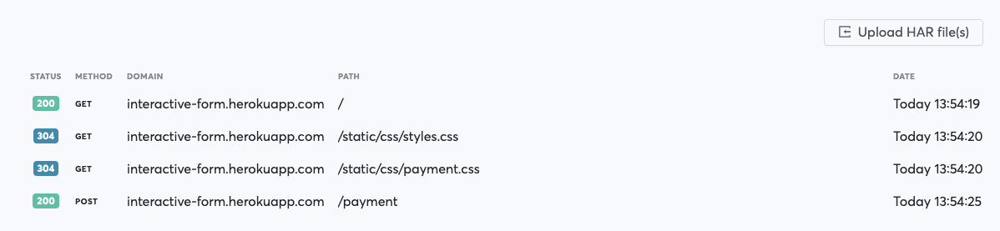
  
  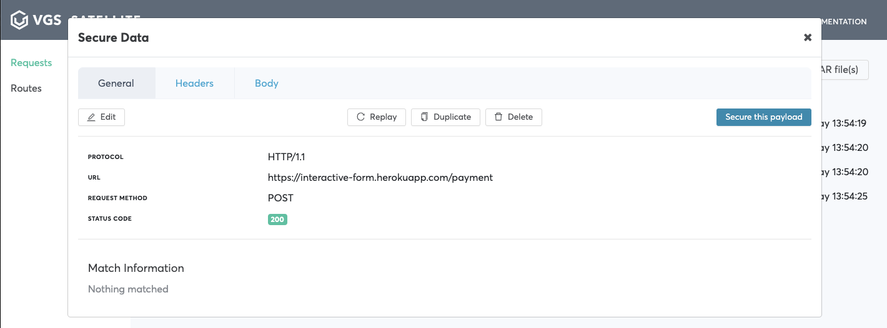
  
1. Pick field that needs to be secured click `Secure this payload` -> `View route configuration` -> `Save inbound route`

  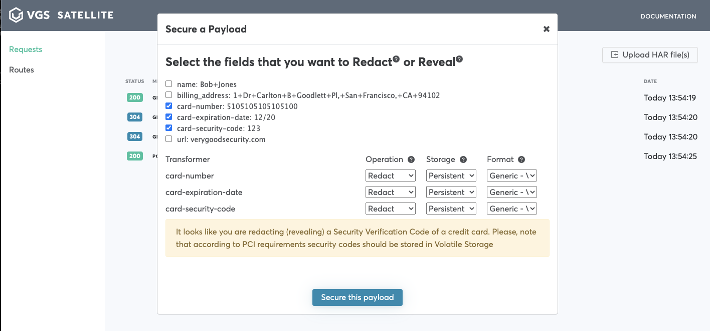
  
1. Visit routes page and delete route created on step #2
  
1. Choose your request in requests list and click `Replay`

   Navigate to request one more time and click `Body`. 
   
  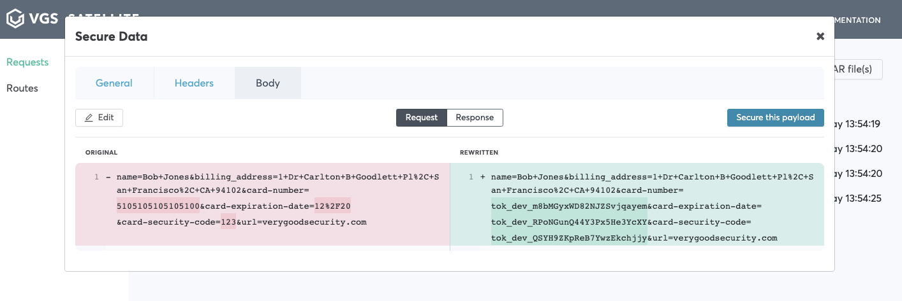
  
  Your payload has been secured!
  


### How to generate outbound route

Lets use outbound route to reveal previously redacted payload scenario

This scenario will help you generate an outbound route using your request, made to a forward proxy

1. Run some request with alias, proxying it through forward proxy. For example:
    ```bash
    curl http://httpbin.org/post -k -x localhost:9099 -H "Content-type: application/json" -d '{"foo": "tok_sat_m8bMGyxWD82NJZSvjqayem"}'
    ```
1. Wait for your requests to appear
   
   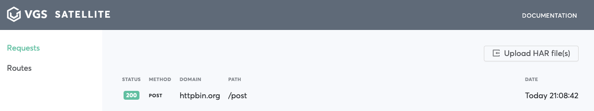
   
1. Choose your request from the list

   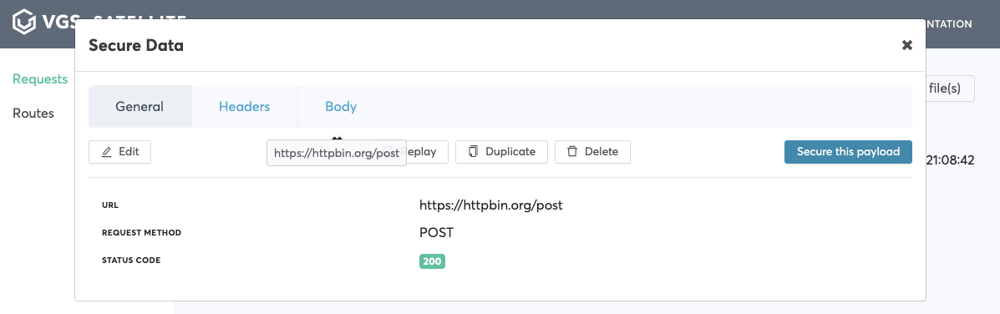
    
1. Click secure you payload

   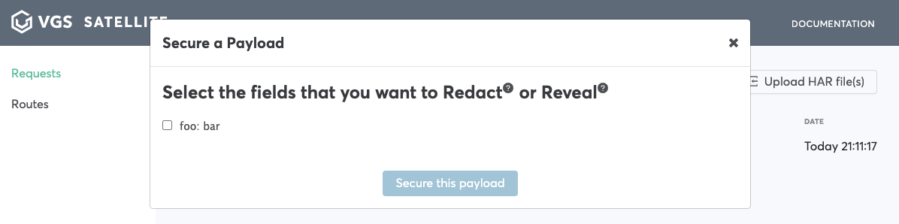
   
1. Check field you would like to reveal, choose `Reveal` in `Operation` dropdown.

   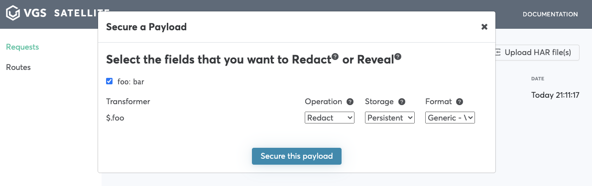

    For additional setting please reference the [nomenclature](https://www.verygoodsecurity.com/docs/terminology/nomenclature)

1. Click `Secure this payload` -> `View route configuration`-> `Save outbound route`
    
    Your route is now available on `Routes` page. You can edit/delete it or import another one from YAML.
    
    
    
1. Re-send request from #3 or navigate to your request on `Requests` and click `Replay`

    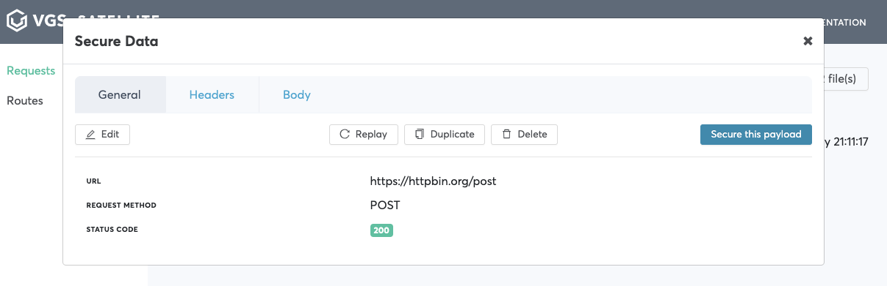
    
1. Click on the replayed request and click `Body` tab. You will see that your payload was redacted. 

    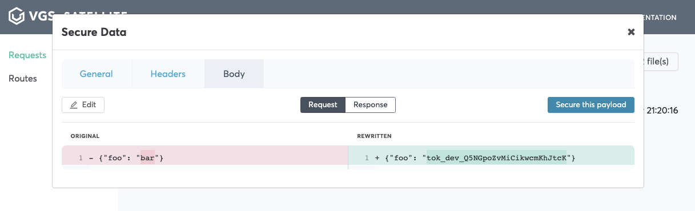

## Python demo <> Satellite

### Inbound route
For inbound route integration example please see [this](https://drive.google.com/file/d/17LobNQBHZ_tA8oU6cKUn9e_GBJn-j2jh/preview)

### Outbound route
For outbound route integration example please see [this](https://drive.google.com/file/d/1aDHWvxjs-TEcADIOei6r86jC3uLKfNHW/preview) 

## Mitmproxy

VGS Satellite's core depends on [mitmproxy](https://github.com/mitmproxy/mitmproxy/). 
**mitmproxy** or man-in-the-middle proxy is an interactive intercepting proxy with ton of build-in functionalities and protocol support.
VGS Satellite is provided as a Open Source product under Apache License v2.0 
