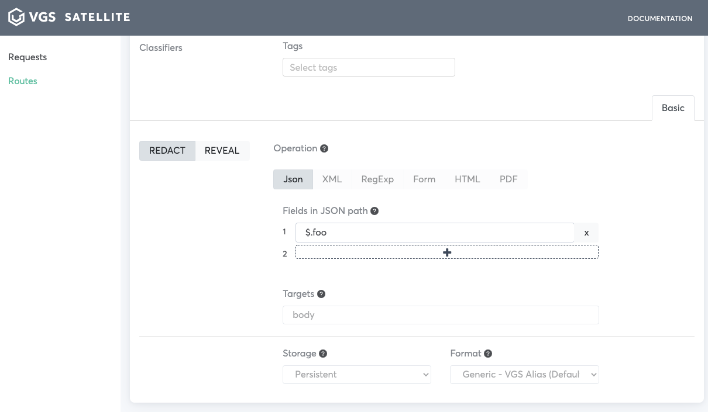
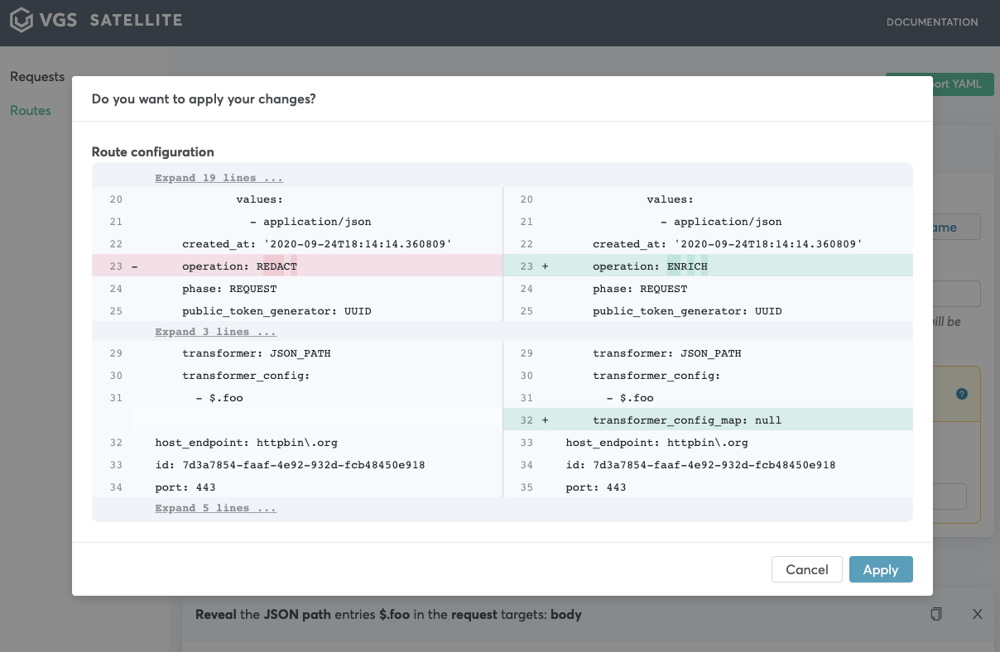

<p align="center"><a href="https://www.verygoodsecurity.com/"></a></p>
<p align="center"><a href="https://www.verygoodsecurity.com/"></a></p>
<p align="center"><b>@vgs/vgs-satellite</b><br/>VGS Offline integration/debugging application.</p>
<p align="center">
<a href="https://circleci.com/gh/verygoodsecurity/vgs-satellite/tree/master"></a>
<a href="https://badge.fury.io/js/%40vgs%2Fvgs-satellite"></a>
<a href="https://badge.fury.io/js/%40vgs%2Fvgs-satellite"></a>
<a href="https://opensource.org/licenses/ISC"></a>
</p>


<!-- toc -->
* [Description](#description)
* [Running from github](#running-from-github)
* [How to run](#how-to-use)
* [Reverse proxy mode](#reverse-proxy-mode)
<!-- tocstop -->

## Description

VGS Satellite is an application that can ease your integration with Very Good Security.
VGS Satellite provides:

    - Demo VGS Vault capabilities
    - Redact/reveal functinality
    - JSON payload request/response transformer
    - Route configuration generator according to specific request
    - Route configuration editor
    - Logging
    - Man-in-the-middle proxy functionality (request incertept/replay/edit/etc)
     
This  application gives you an ability to run requests with your service and transform them into suitable VGS route configuration
without any need to sign up.

## Running from github

1. Clone sources
    ```bash
        git clone git@github.com:verygoodsecurity/vgs-satellite.git && cd vgs-satellite
    ```

1. Create `~/.mitmproxy/config.yaml` configuration file. 
    ```bash
        echo "listen_port: 9099\nweb_port: 8089\nweb_host: localhost\nweb_open_browser: false" > ~/.mitmproxy/config.yaml
    ```
   
    
1. Run application...

    a) ...in browser 
    ```bash
        npm i
        npm start
    ```
    b) ...in electron 
    ```bash
       npm i
       npm run start:app
    ```

## How to use 

_Note: this manual of how to use vgs-satellite assuming you are running from docker-compose_

1. Run application. 
   We assume that content of `.env` wasn't changed
1. Open [http://localhost:1234](http://localhost:1234) or wait for electron application to start
1. Run example requests:
    ```bash
    curl http://httpbin.org/post -k -x localhost:9099 -H "Content-type: application/json" -d '{"foo": "bar"}'
    ```
1. Wait for your requests to appear
   
   
   
1. Choose your request from the list

   
    
1. Click secure you payload

   
   
1. Check field you would like to secure.

   

    For additional setting please reference the [nomenclature](https://www.verygoodsecurity.com/docs/terminology/nomenclature)

1. Click `Secure this payload`, then `View route configuration`

   
   
1. Switch to `Outbound` and click `Save route`
    
    Your route is now available on `Routes` page. You can edit/delete it or import another one from YAML.
    
    
    
1. Re-send request from #3 or navigate to your request on `Requests` and click `Replay`

    
    
1. Click on the replayed request and click `Body` tab. You will see that your payload was redacted. 

    
    
1. Navigate to `Routes` page and click `Manage` on route you saved. Switch `Redact` to `Reveal`.

    

    Click `Save`

    

1. Send request substituting raw payload with aliased one from #11

    ```bash
    curl http://httpbin.org/post -k -x localhost:9099 -H "Content-type: application/json" -d '{"foo": "tok_dev_Q5NGpoZvMiCikwcmKhJtcK"}'
    ```
   
   You will see previously sent raw payload.
   
   
## Reverse proxy mode

VGS Satellite can be run in reverse proxy mode. For this add `mode: reverse:upstream.local` to the end of ~/.mitmproxy/config.yaml.
You would need to run request directly to `localhost:9099` without -x(proxy option) in #3 and #13 