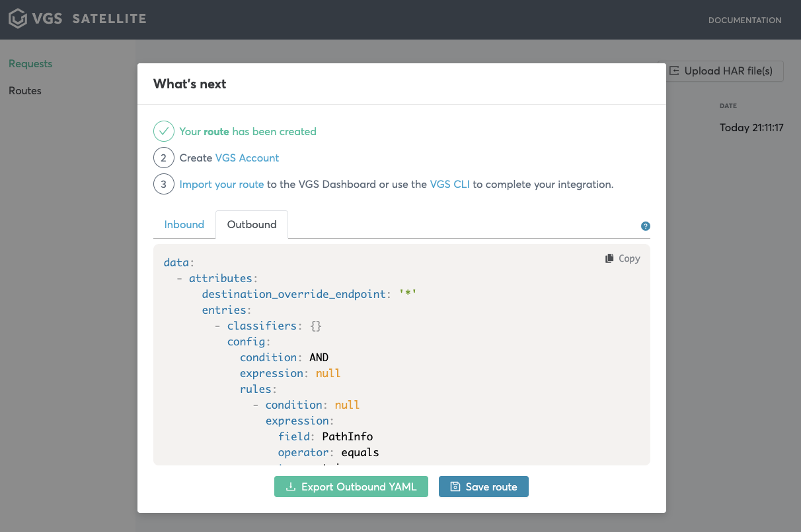

<p align="center"><a href="https://www.verygoodsecurity.com/"></a></p>
<p align="center"><b>@vgs/vgs-satellite</b><br/>VGS Offline integration application.</p>
<p align="center">
<a href="https://circleci.com/gh/verygoodsecurity/vgs-satellite/tree/master"></a>
<a href="https://badge.fury.io/js/%40vgs%2Fvgs-satellite"></a>
<a href="https://badge.fury.io/js/%40vgs%2Fvgs-satellite"></a>
<a href="https://opensource.org/licenses/ISC"></a>
</p>


<!-- toc -->
* [Description](#description)
* [Environment variables](#environment-variables)
* [Running from github](#running-from-github)
* [Node Package Manager](#node-package-manager)
* [Docker image](#docker-image)
* [How to run](#how-to-use)
* [Mitmproxy](#running-mimtmproxy-separately)
<!-- tocstop -->

## Description

VGS Satellite is an  application for offline integration with Very Good Security.
This  application gives you an ability to run requests with your service and transform them into suitable VGS route configuration
without any need to sign up.

## Running from github

1. Clone sources
    ```bash
        git clone git@github.com:verygoodsecurity/vgs-satellite.git && cd vgs-satellite
    ```

1. Create `~/.mitmproxy/config.yaml` configuration file. For config nomenclature refrence [this](https://docs.mitmproxy.org/stable/concepts-options/)
    ```bash
        echo "listen_port: 9099\nweb_port: 8089\nweb_host: localhost\nweb_open_browser: false" > ~/.mitmproxy/config.yaml
    ```
   **Note:** Not all mitmproxy configurations may be supported. If you encountered any issue, please contact satellite@verygoodsecurity.com
    
1. Run application...
    a) ...in browser 
    ```bash
        npm i
        npm start
    ```
    b) ...in electron 
    ```bash
       npm i
       npm run start:app
    ```

## How to use 

_Note: this manual of how to use vgs-satellite assuming you are running from docker-compose_

1. Run application. 
   We assume that content of `.env` wasn't changed
1. Run example requests:
    ```bash
    curl -H "Content-Type: application/json" -x http://localhost:1230 http://httpbin.org/post -d '{"foo": "bar"}'
    ```
1. Open [http://localhost:1234](http://localhost:1234)
1. Wait for your requests to appear or add your HAR file by clicking `Upload HAR file(s)`

   _Note: you can find HAR file of your requests in /path/to/vgs-satallite/mitm-requests_
   
   
   
1. Choose your request from the list

   
    
1. Click secure you payload

   
   
1. Check field you would like to secure.

   

    For additional setting please reference the [nomenclature](https://www.verygoodsecurity.com/docs/terminology/nomenclature)

1. Click `Secure this payload`, then `View route configuration`

   
   
1. Download inbound/outbound route and reference instructions provided to import your first route on VGS Dashboard!
