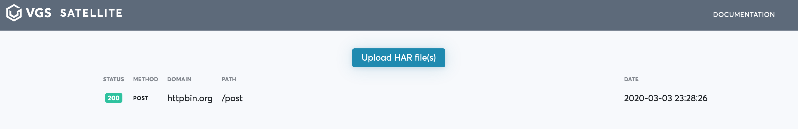
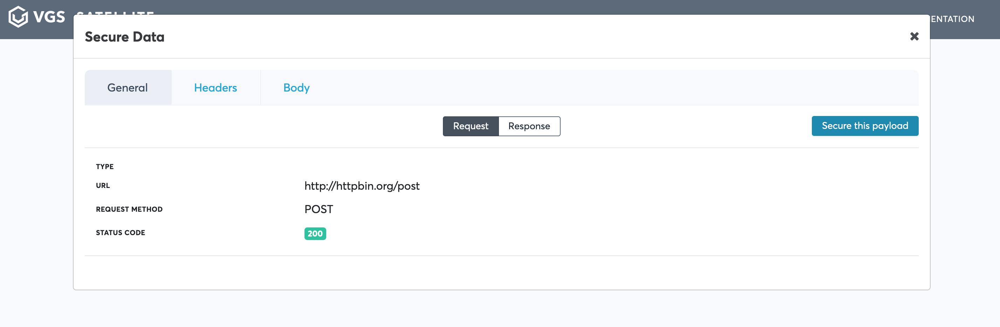
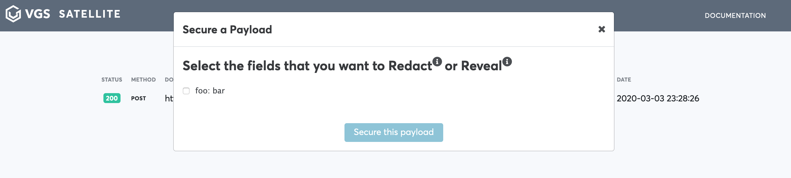
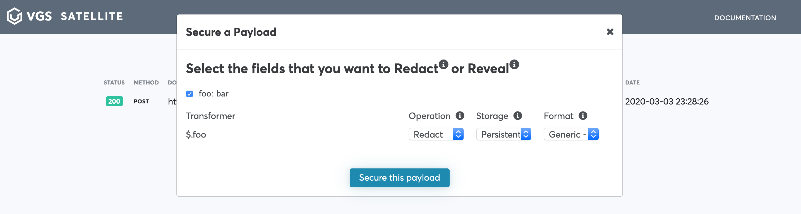

# VGS-Satellite

VGS Offline integration project.

## Building and running on localhost

1. Install dependencies:
    ```bash
    npm install
    ```

1. Then run project:

    - in hot module reloading mode:
  
        ```bash
        npm run dev
        ```

    - or build and serve production version:

        ```bash
        npm run start
        ```

3. Then open [http://localhost:1234](http://localhost:1234) in your browser


## Building and running via docker-compose

1. Create or use `.env` file inside project root

    Environment variables in `.env`:
    - `PROXY_PORT` - port to run mitmproxy on
    - `WEB_PORT` - port to run mitmproxy web UI on
    - `SATELLITE_PORT` - port to run vgs-satellite web UI on
    - `MITM_DIR` - directory that would be mapped inside container to store mitmproxy intercepted requests (default)
    
1. Run project

    ```bash
   docker-compose up 
   ```
   

_Note: mitmproxy in docker-compose is being run with custom script to save har-json representation of requests/response pair in folder on fly. 
If you rum mitmproxy separately, use the following command:_

```bash
mitmweb -s script/mitm-requests-json.py
``` 


## How to use 

_Note: this manual of how to use vgs-satellite assuming you are running from docker-compose_

1. Run project. See:  [Building and running via docker-compose](#Building and running via docker-compose)
   We assume that content of `.env` wasn't changed
1. Run example requests:
    ```bash
    curl -H "Content-Type: application/json" -x http://localhost:1230 http://httpbin.org/post -d '{"foo": "bar"}'
    ```
1. Open [http://localhost:1234](http://localhost:1234)
1. Click `Upload HAR file(s)` and choose HAR file.

   _Note: you can find HAR file of your requests in /path/to/vgs-satallite/mitm-requests_
   
   
   
1. Choose your request from the list

   
    
1. Click secure you payload

   
   
1. Check field you would like to secure.

   

    For additional setting please reference the [nomenclature](https://www.verygoodsecurity.com/docs/terminology/nomenclature)

1. Click `Secure this payload`, then `View route configuration`

   
   
1. Download inbound/outbound route and reference instructions provided to import your first route on VGS Dashboard!
   